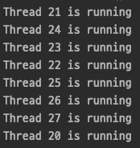
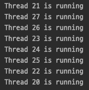
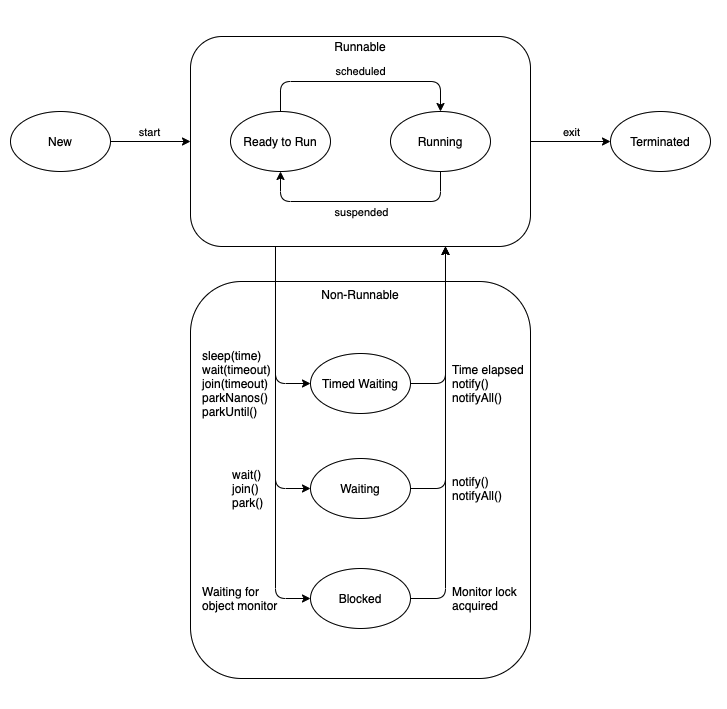

# Java Thread

멀티 쓰레딩은 CPU 를 최대한 활용하기 위해 애플리케이션의 두 개 이상의 부분을 동시에 실행할 수 있는 Java 기능이다.  
이러한 애플리케이션의 각 부분을 쓰레드라고 하고 프로세스 내의 경량 프로세스이다.

두가지 메커니즘을 사용하여 쓰레드를 만들 수 있다.
1. Thread 클래스 상속
2. Runnable 인터페이스 구현

## Thread 클래스 상속을 통한 쓰레드 생성

`java.lang.Thread` 클래스를 상속하는 클래스를 생성한다.  
이 클래스는 Thread 클래스에서 사용할 수 있는 run() 메서드를 재정의한다.  
쓰레드는 run() 메서드 내에서 수명을 시작한다.  
새 클래스의 객체를 만들고 start() 메서드를 호출하여 쓰레드를 시작한다. start() 메서드는 Thread 객체에서 run() 메서드를 호출한다.  

```java
public class StudyThread extends Thread {
    @Override
    public void run() {
        System.out.println("Thread " + Thread.currentThread().getId() + " is running");
    }
}
```
```java
public class Main {
    public static void main(String[] args) {
        for (int i = 0; i < 8; i++) {
            StudyThread thread = new StudyThread();
            thread.start();
        }
    }
}
```


## Runnable 인터페이스 구현을 통한 쓰레드 생성

`java.lang.Runnable` 인터페이스를 구현하고 run() 메서드를 재정의하는 새 클래스를 생성한다.  
해당 클래스를 인스턴스화하고 이 객체에 대해 start() 메서드를 호출한다.  

```java
public class StudyThread implements Runnable {
    @Override
    public void run() {
        System.out.println("Thread " + Thread.currentThread().getId() + " is running");
    }
}
```
```java
public class Main {
    public static void main(String[] args) {
        for (int i = 0; i < 8; i++) {
            Thread thread = new Thread(new StudyThread());
            thread.start();
        }
    }
}
```


## Thread Class vs Runnable Interface

1. Thread 클래스를 상속하면 Java 가 다중 상속을 지원하지 않으므로 다른 클래스를 상속할 수 없다.  
그러나 Runnable 인터페이스를 구현하면 다른 클래스를 상속할 수 있다.  
2. Runnable 인터페이스에서는 사용할 수 없는 yield(), interrupt() 등과 같은 내장 메서드를 사용할 수 없지만 Thread 클래스를 상속하면 이런 기본 기능을 사용할 수 있다.  
3. Runnable 인터페이스를 구현하면 여러 쓰레드간에 공유할 수 있는 객체를 생성할 수 있다.

## Lifecycle and States

1. New
2. Runnable
3. Blocked
4. Waiting
5. Timed Waiting
6. Terminated



<hr>

#### References

> 웹 문서
> - [geeksforgeeks | Multithreading in Java](https://www.geeksforgeeks.org/multithreading-in-java/)
> - [geeksforgeeks | Lifecycle and States of a Thread in Java](https://www.geeksforgeeks.org/lifecycle-and-states-of-a-thread-in-java/)
> - [geeksforgeeks | Main thread in Java](https://www.geeksforgeeks.org/main-thread-java/)
> - [geeksforgeeks | Java-Multithreading Archives](https://www.geeksforgeeks.org/tag/java-multithreading/)
> - [geeksforgeeks | Thread Pools in Java](https://www.geeksforgeeks.org/thread-pools-java/)
> - [geeksforgeeks | Java.lang.Thread class in Java](https://www.geeksforgeeks.org/java-lang-thread-class-java/)
> - [geeksforgeeks | Runnable interface in Java](https://www.geeksforgeeks.org/runnable-interface-in-java/)
> - [geeksforgeeks | Implement Runnable vs Extend Thread in Java](https://www.geeksforgeeks.org/implement-runnable-vs-extend-thread-in-java/)
> - [baeldung | Java Concurrency](https://www.baeldung.com/java-concurrency)
> - [baeldung | Life Cycle of a Thread in Java](https://www.baeldung.com/java-thread-lifecycle)
> - [baeldung | How to Start a Thread in Java](https://www.baeldung.com/java-start-thread)
> - [baeldung | Runnable vs. Callable in Java](https://www.baeldung.com/java-runnable-callable)
> - [baeldung | Implementing a Runnable vs Extending a Thread](https://www.baeldung.com/java-runnable-vs-extending-thread)
> - [ducmanhphan | How to use CompletableFuture and Callable in Java](https://ducmanhphan.github.io/2020-02-10-How-to-use-CompletableFuture-Callable-in-Java/)
